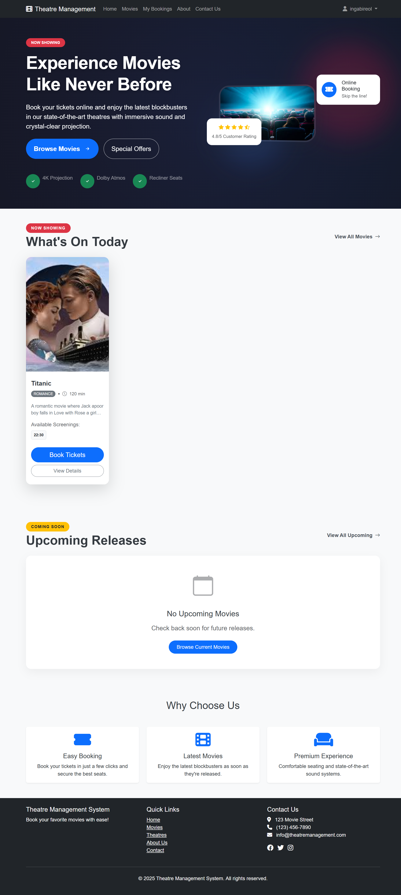

# Theatre Management System


## Overview

Theatre Management System is a comprehensive web application designed to streamline the process of managing movie theatres, screenings, bookings, and user interactions. Built with Spring Boot, Thymeleaf, and Bootstrap, this system provides a robust solution for theatre administrators and an intuitive interface for customers.

## Features

### For Customers
- **Movie Browsing**: View currently playing and upcoming movies
- **Advanced Search**: Filter movies by title, genre, and date
- **Seat Selection**: Interactive seat map with real-time availability
- **Booking Management**: View, manage, and cancel bookings
- **User Accounts**: Register, login, and maintain profile information

[//]: # (![Customer Dashboard]&#40;src/main/resources/static/images/&#41;)

### For Theatre Managers
- **Movie Management**: Add, edit, and remove movies from the system
- **Theatre Configuration**: Manage theatre locations and screen details
- **Seat Management**: Configure seating layouts for each screen
- **Screening Management**: Schedule movie showings with flexible time slots
- **Booking Oversight**: View and manage customer bookings


### For Administrators
- **User Management**: Create and manage user accounts with different roles
- **System Monitoring**: Track system performance and usage statistics
- **Content Management**: Control all aspects of the theatre management system
- **Reporting**: Generate reports on sales, attendance, and other metrics

## Technical Architecture

### Backend
- **Spring Boot**: Core application framework
- **Spring Security**: Authentication and authorization
- **Spring Data JPA**: Data access and persistence
- **PostgreSQL**: Primary database

### Frontend
- **Thymeleaf**: Server-side Java template engine
- **Bootstrap 5**: Responsive CSS framework
- **JavaScript/jQuery**: Enhanced user interfaces
- **Font Awesome**: Icon library


## Screenshots

### Home Page


### Movie Details


### Seat Selection


### Admin Movies Management


### Admin Theatre Management


## Installation and Setup

### Prerequisites
- Java 17+
- Maven 3.6+
- PostgreSQL 14+
- Modern web browser

### Database Setup
1. Create a PostgreSQL database named `theatre_db`
2. Update the database configuration in `application.properties` if needed:
```properties
spring.datasource.url=jdbc:postgresql://localhost:5432/theatre_db
spring.datasource.username=postgres
spring.datasource.password=yourpassword
```

### Running the Application
1. Clone the repository:
```bash
git clone https://github.com/ingabireol/theatre-management-system.git
cd theatre-management-system
```

2. Build and run the application using Maven:
```bash
./mvnw spring-boot:run
```

3. Access the application at `http://localhost:8080`

### Default Admin Credentials
- Username: `admin`
- Password: `admin123`

### Default Manager Credentials
- Username: `manager`
- Password: `manager123`

## Development

### Project Structure
```
src/
├── main/
│   ├── java/
│   │   └── com/
│   │       └── thms/
│   │           ├── config/       # Configuration classes
│   │           ├── controller/   # MVC controllers
│   │           ├── dto/          # Data transfer objects
│   │           ├── model/        # Entity classes
│   │           ├── repository/   # Data repositories
│   │           ├── service/      # Business logic
│   │           └── TheatreManagementSystemApplication.java
│   └── resources/
│       ├── static/              # Static resources (CSS, JS)
│       ├── templates/           # Thymeleaf templates
│       └── application.properties
└── test/                        # Test classes
```

### Key Design Patterns
- **MVC Architecture**: Separation of concerns between Model, View, and Controller
- **Repository Pattern**: Data access abstraction
- **Service Layer**: Business logic encapsulation
- **DTO Pattern**: Data transfer between layers

## Roadmap

### Upcoming Features
- Mobile application integration
- Online food ordering system
- Loyalty program and points system
- Integration with external payment gateways
- Machine learning for personalized movie recommendations

## Contributing

Contributions are welcome! Please feel free to submit a Pull Request.

1. Fork the repository
2. Create your feature branch (`git checkout -b feature/AmazingFeature`)
3. Commit your changes (`git commit -m 'Add some AmazingFeature'`)
4. Push to the branch (`git push origin feature/AmazingFeature`)
5. Open a Pull Request

## License

This project is licensed under the MIT License - see the LICENSE file for details.

## Acknowledgements

- [Spring Boot](https://spring.io/projects/spring-boot)
- [Thymeleaf](https://www.thymeleaf.org/)
- [Bootstrap](https://getbootstrap.com/)
- [Font Awesome](https://fontawesome.com/)
- [PostgreSQL](https://www.postgresql.org/)

## Contact

Ingabire Olivier - [ingabireolivier080@gmail.com](mailto:your.email@ingabirelivier080@gmail.com)


Project Link: [https://github.com/ingabireol/theatre-management-system](https://github.com/yourusername/theatre-management-system)
